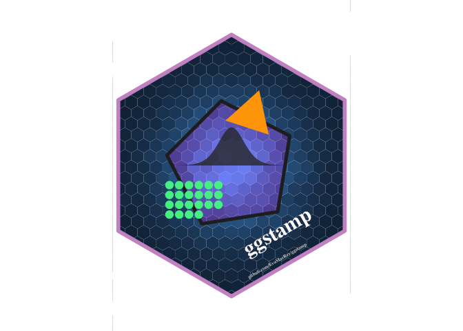

<!-- README.md is generated from README.Rmd. Please edit that file -->

### {ggstamp} [*on github*](github.com/EvaMaeRey/ggstamp)

> ‘In God we trust, all others must bring data.’ - W. Edwards Deming.

> Annotation layers must also ‘bring data’ … or do they?


[Open flipbook in a new
tab](https://evamaerey.github.io/ggstamp/flipbook.html)

<!-- badges: start -->

[](https://lifecycle.r-lib.org/articles/stages.html#experimental)
<!-- badges: end -->

The goal of ggstamp is to provide convenience functions for creating
annotation layers in the ggplot2 and grammar of graphics framework. It
is experimental; let’s see where things lead.

In some ways, Deming’s quote parallels the experience of analysts using
ggplot2. Adding geom\_\* layers feels almost godly (geom\_point() = ‘let
there be points’, geom\_boxplot() ‘let there be boxplots’\!). But
*annotation layers* are subject to Deming’s burden of *‘bringing data’*.

The geom\_\* calls feel lightweight and powerful because they refer to
the *already specified* data and aesthetic mappings. Recall the
definition of a data visualization

A data visualization is …

… composed of geometric marks …

… that take on variation in visual channels (aesthetics) …

… that represent variables in a data set …

In practice, the data is declared first and second the
aesthetic-variable encodings. Finally, with this *groundwork laid* of
prespecifying data and aesthetic-variable pairs, the code call to get
the geometric layer feels light and nimble\!

Because geom\_\* marks have the data already laid out, they don’t feel
like you have to ‘bring data’.

So using geom\_tile() or geom\_point() or geom\_line() feels a bit
supernatural – ink spring up through the page based on the combination
of 1) the data that lies beneath and 2) the geom\_\*() call.

<!-- Annotation layers in grammar of graphics frameworks feel different than adding geom_* layers.  This is because w/ the separation of visual concerns, data is often declared separately from the geom.  The data is foundational and sits below everything.  The ink on the page depends on this underlying data once goem_* layers are declared.   -->

Adding an annotation layer feels different. With annotation geoms/marks,
you must *simultaneously* declare the mark/geom *and* data.

In ggplot2, use of the annotate() function is most often prescribed.
It’s not so easy for newcomers to use.

‘ggstamp’ thinks about removing some of the thinking and focus that’s
needed to create annotation layer.

First, they use a stamp prefix and then name the geom that’s desired,
i.e. stamp\_point(), stamp\_text() - good for auto-complete IDEs
(RStudio).

Also we include the arguments and descriptions so adjustments can more
easily be made from IDE with argument previews.

Finally, the functions include default data\! You will be able to check
out what stamp\_\* functions do without any input (then you can adjust
away from the defaults later); in other words ggstamp functions are
‘pre-inked’ (they’ll automatically bring data). They’ll ‘just work’ –
maybe not as needed in their final form – but getting something
out-of-the box can be a useful starting point for newcomers.

And the development version from [GitHub](https://github.com/) with:

``` r
# install.packages("devtools")
devtools::install_github("EvaMaeRey/ggstamp")
```

``` r
library(tidyverse)
library(ggstamp)  
set.seed(1243)
tibble::tibble(x = rnorm(40000, sd = .7),
       y = rnorm(40000, sd = .7)) %>% 
  ggplot() + 
  aes(x = x, y = y) +
  geom_hex(show.legend = F, color = alpha("white", 0)) + 
  coord_equal(xlim = c(-1.65,1.65), ylim = c(-2.3, 2.3)) + 
  stamp_polygon_inverse(radius = 2, radius_outer = Inf, fill = "white"
                        ) +
  stamp_polygon(alpha = .2, n = 5, size = 1.75,
                fill = "magenta", color = "grey15",
                rotation = -.55) + 
  stamp_polygon(radius = .4, n = 3,
                x0 = .3, y0 = .77, rotation = -.4,
                alpha = 1, fill = "orange", size = 0) + 
  stamp_text(angle = 30, label = "ggstamp",
             x = .7, y = -1,
             color = "snow1") + 
  stamp_text(angle = 30, label = "github.com/EvaMaeRey/ggstamp",
             x = .7, y = -1.45, size = 1.8,
             color = "grey85") + 
  stamp_polygon(radius = 2, 
                alpha = 0, size = 2,
                color = "plum3") + 
  theme_void() +
  ggxmean::stamp_normal_dist(sd = .2, alpha = .8, height = 1.5) + 
  stamp_point(xy = pos_wrap(n = 22, ncol = 6, width = .15, x0 = -.95, y0 = -.3), size = 3,
              color = "seagreen2") ->
g; g
```



``` r

ggsave("docs/hex_sticker_ggstamp.png")
```
